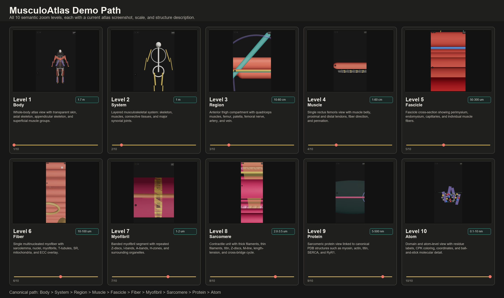

# MusculoAtlas

Zoom from a human body to a single atom — 10 levels of musculoskeletal anatomy.

MusculoAtlas is a monorepo atlas for continuous semantic zoom through gross anatomy, muscle microstructure, sarcomere ultrastructure, PDB protein structures, and atomic domain detail. The viewer changes biological meaning at every level instead of simply magnifying the same mesh.

## Demo Path



The Demo Path is a static atlas figure: every level is shown with its current viewer screenshot, biological scale, and concise structure description.

Canonical release breadcrumb:

`Body > Thigh > Quad > Fascicle > Fiber > Myofibril > Sarcomere > Myosin > S1 domain > Atom`

## Levels

| Level | Scale | Experience |
| --- | --- | --- |
| 1 | 1.7 m | Full body musculoskeletal overview |
| 2 | 1 m | Skeletal, muscular, connective, and joint layers |
| 3 | 10-60 cm | Regional compartments such as anterior thigh |
| 4 | 1-60 cm | Single muscle metadata, fiber architecture, tendon entry |
| 5 | 50-300 um | Fascicles with perimysium, endomysium, capillaries |
| 6 | 10-100 um | Muscle fiber organelles and ECC physiology |
| 7 | 1-2 um | Myofibril banding pattern |
| 8 | 2.0-3.5 um | Sarcomere filaments, length-tension, cross-bridge cycle |
| 9 | 5-500 nm | PDB protein structures with Molstar/custom R3F modes |
| 10 | 0.1-10 nm | Domain and atom-level selections |

Parallel tissue tracks cover tendon T1-T6, bone B1-B5, cartilage zones, and synovial joint structure.

## Quick Start

```bash
pnpm install
pnpm dev
```

For quality gates:

```bash
pnpm biome
pnpm typecheck
pnpm test
pnpm --filter @musculo-atlas/web build
```

## Data Sources

- BodyParts3D and Z-Anatomy for gross mesh targets and segmentation strategy.
- RCSB PDB for myosin, actin, titin, nebulin, alpha-actinin-2, SERCA, RyR1, and domain structures.
- Research Report values encoded in `apps/web/src/lib/dimensions.ts`, `microAnatomy.ts`, `sarcomere.ts`, `molecular.ts`, `physiology.ts`, and `connectiveTissue.ts`.

## Architecture

```text
Next.js web app
  -> semantic zoom engine
  -> typed hierarchy and biological dimensions
  -> R3F gross/procedural/ultrastructural renderers
  -> Molstar/custom molecular render modes
  -> physiology and tissue overlays

FastAPI service
  -> anatomy, protein, and search endpoints

Data pipeline
  -> mesh processing, FMA mapping, muscle catalog, PDB fetching

Rust mesh tools
  -> decimation and LOD generation
```

## Contributing

Keep biological constants in typed library modules, add tests for each quality gate, and prefer instancing or lazy-loaded assets for anything repeated at cellular and molecular scale. Use `pnpm biome`, `pnpm typecheck`, and `pnpm test` before opening changes.
